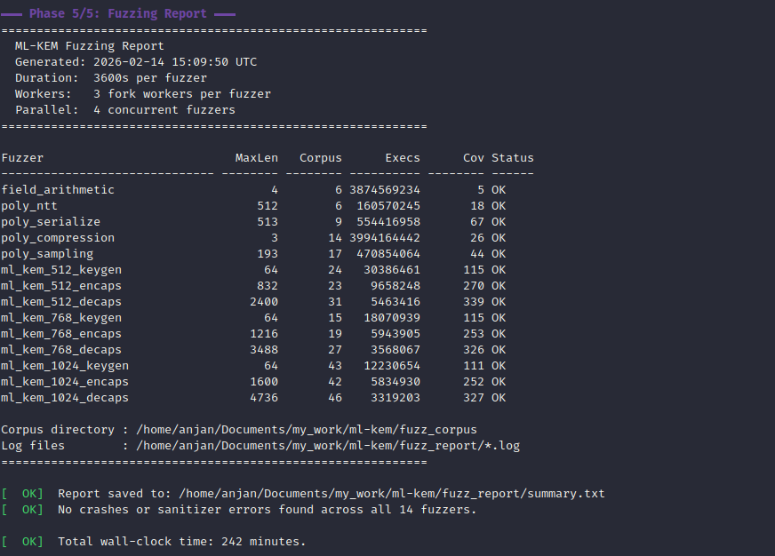

# ML-KEM (formerly known as Kyber)

NIST FIPS 203 (ML-KEM) standard compliant, C++20, fully `constexpr`, header-only library implementation.
FIPS 203 compliance is assured by testing this implementation against ACVP Known Answer Tests and tons of property based tests. We also fuzz the library and its internal components with LLVM libFuzzer to get an extra level of assurance.

> [!NOTE]
> `constexpr` ? Yes, you can compile-time execute keygen, encapsulation and decapsulation.

<!-- -->

> [!CAUTION]
> This ML-KEM implementation is conformant with ML-KEM standard <https://doi.org/10.6028/NIST.FIPS.203> and I also *try* to make it timing leakage free, but be informed that this implementation is not *yet* audited. **If you consider using it in production, please be careful !**

## Quick Start

Add `ml-kem` to your CMake project via `FetchContent`:

```cmake
include(FetchContent)
FetchContent_Declare(
  ml-kem
  GIT_REPOSITORY https://github.com/itzmeanjan/ml-kem.git
  GIT_TAG master
  GIT_SHALLOW TRUE
)
FetchContent_MakeAvailable(ml-kem)

target_link_libraries(my_app PRIVATE ml-kem)
```

Generate a keypair, encapsulate a shared secret, and decapsulate it:

```cpp
#include "ml_kem/ml_kem_768.hpp"
#include "randomshake/randomshake.hpp"

// Generate a keypair
std::array<uint8_t, ml_kem_768::SEED_D_BYTE_LEN> d{};
std::array<uint8_t, ml_kem_768::SEED_Z_BYTE_LEN> z{};
std::array<uint8_t, ml_kem_768::PKEY_BYTE_LEN> pubkey{};
std::array<uint8_t, ml_kem_768::SKEY_BYTE_LEN> seckey{};

randomshake::randomshake_t csprng{};
csprng.generate(d);
csprng.generate(z);
ml_kem_768::keygen(d, z, pubkey, seckey);

// Encapsulate a shared secret
std::array<uint8_t, ml_kem_768::SEED_M_BYTE_LEN> m{};
std::array<uint8_t, ml_kem_768::CIPHER_TEXT_BYTE_LEN> cipher{};
std::array<uint8_t, ml_kem_768::SHARED_SECRET_BYTE_LEN> sender_key{};
csprng.generate(m);

const bool encaps_ok = ml_kem_768::encapsulate(m, pubkey, cipher, sender_key);

// Decapsulate the shared secret
std::array<uint8_t, ml_kem_768::SHARED_SECRET_BYTE_LEN> receiver_key{};
ml_kem_768::decapsulate(seckey, cipher, receiver_key);

assert(encaps_ok && sender_key == receiver_key);
```

See [examples/](./examples/) for a complete standalone CMake project.

## Motivation

ML-KEM has been standardized by NIST as post-quantum secure key encapsulation mechanism (KEM), which can be used for key establishment, between two parties, communicating over insecure channel.

ML-KEM offers an *IND-CCA-secure* Key Encapsulation Mechanism - its security is based on the hardness of solving the learning-with-errors (LWE) problem in module (i.e. structured) lattices.

ML-KEM is built on top of *IND-CPA-secure K-PKE*, where two communicating parties, both generating their key pairs, while publishing only their public keys to each other, can encrypt fixed length ( = 32 -bytes ) message using peer's public key. Cipher text can be decrypted by corresponding secret key ( which is private to the keypair owner ) and 32 -bytes message can be recovered back. Then a slightly tweaked Fujisaki–Okamoto (FO) transform is applied on *IND-CPA-secure K-PKE* - giving us the *IND-CCA-secure ML-KEM* construction. In KEM scheme, two parties interested in establishing a secure communication channel, over public & insecure channel, can generate a 32 -bytes shared secret key. Now they can use this 32 -bytes shared secret key in any symmetric key primitive, either for encrypting their communication (in much faster way) or deriving new/ longer keys.

Algorithm | Input | Output
--- | :-: | --:
KeyGen | - | Public Key and Secret Key
Encapsulation | Public Key | Cipher Text and 32B Shared Secret
Decapsulation | Secret Key and Cipher Text | 32B Shared Secret

Here I'm maintaining `ml-kem` - a C++20 header-only fully `constexpr` library, implementing ML-KEM, supporting ML-KEM-{512, 768, 1024} parameter sets, as defined in table 2 of ML-KEM standard. It's easy to use, see [usage](#usage).

ML-KEM-768 shows following performance characteristics on desktop and server grade CPUs.

ML-KEM-768 Algorithm | Time taken on "12th Gen Intel(R) Core(TM) i7-1260P" (`x86_64`) | Time taken on "AWS EC2 Instance c8g.large, featuring ARM Neoverse-V2" (`aarch64`)
--- | --: | --:
keygen | 19.3us | 28.8us
encaps | 21.9us | 32.8us
decaps | 25.8us | 39.3us

> [!NOTE]
> Find ML-KEM standard @ <https://doi.org/10.6028/NIST.FIPS.203> - this is the document that I followed when implementing ML-KEM. I suggest you go through the specification to get an in-depth understanding of the scheme.

## Security & Robustness

This implementation is built with a "Security-First" approach, incorporating programming language features and multiple tools for enforcement:

- **No Raw Pointers**: Completely avoids dealing with raw pointers. Everything is wrapped in statically-sized `std::span`, which provides much better type safety and compile-time error reporting as the exact byte lengths for all buffers (seeds, keys, ciphertexts, shared secrets) are known for each parameter set.
- **Strict Build Guards**: Compiled with `-Werror` and comprehensive warning flags (`-Wall -Wextra -Wpedantic -Wshadow -Wconversion -Wformat=2`). Any warnings triggered during compilation are treated as fatal errors.
- **Memory Safety**: Verified using AddressSanitizer (ASan) in both release and debug build configuration.
- **Undefined Behavior**: Hardened with UndefinedBehaviorSanitizer (UBSan), configured to treat any undefined behavior as a fatal, non-recoverable error.
- **Continuous Fuzzing**: Includes a suite of **14 specialized fuzzer binaries** (9 key encapsulation variants + 5 internal component units).
- **Static Analysis**: Integrated with `clang-tidy` using an extensive check suite (`bugprone-*`, `cert-*`, `clang-analyzer-*`, `concurrency-*`, `cppcoreguidelines-*`, `hicpp-*`, `misc-*`, `modernize-*`, `performance-*`, `portability-*`, `readability-*`) with all warnings treated as errors.
- **CI-Verified**: Automatically tested on every push across a matrix of operating systems (Linux, macOS) and compilers (`clang++`, `g++`).

## Prerequisites

- A C++ compiler such as `clang++`/ `g++`, with support for compiling C++20 programs.
- CMake 3.28 or later.
- For testing, `google-test` is required. It can be installed globally or fetched automatically by setting `-DML_KEM_FETCH_DEPS=ON`.
- For benchmarking, `google-benchmark` is required. It can be installed globally or fetched automatically by setting `-DML_KEM_FETCH_DEPS=ON`.
- For static analysis, you'll need `clang-tidy`.
- For code formatting, you'll need `clang-format`.

### Automatically Fetched Dependencies

The following libraries are **automatically fetched** by CMake at configure time -- no manual installation needed:

- [`sha3`](https://github.com/itzmeanjan/sha3): SHA3 suite of hash functions, from FIPS 202, used internally by ML-KEM.
- [`randomshake`](https://github.com/itzmeanjan/RandomShake): A CSPRNG built on (Turbo)SHAKE256 XOF, seeded from OS entropy. Used in tests, benchmarks and examples for generating keygen seeds and encapsulation randomness. You may use any cryptographically secure pseudo-random source to fill the seed arrays; the library does not mandate a specific RNG.
- [`subtle`](https://github.com/itzmeanjan/subtle): A header-only library providing constant-time comparison utilities.

> [!NOTE]
> If you are on a machine running GNU/Linux kernel and you want to obtain *CPU cycle* count for ML-KEM routines, you should consider building `google-benchmark` library with `libPFM` support, following <https://gist.github.com/itzmeanjan/05dc3e946f635d00c5e0b21aae6203a7>, a step-by-step guide. Find more about libPFM @ <https://perfmon2.sourceforge.net>. When `libpfm` is installed, CMake will automatically detect and link it.

## Building

For testing functional correctness of this implementation and conformance with ML-KEM standard, you have to run following command(s).

> [!NOTE]
> All Known Answer Test (KAT) files live inside [kats](./kats/) directory. KAT files from official reference implementation, are generated by following (reproducible) steps, described in <https://gist.github.com/itzmeanjan/c8f5bc9640d0f0bdd2437dfe364d7710>. ACVP KATs can be synced by building `sync_acvp_kats` target.

### CMake Options

| Option | Description | Default |
| :--- | :--- | :--- |
| `ML_KEM_BUILD_TESTS` | Build test suite | `OFF` |
| `ML_KEM_BUILD_BENCHMARKS` | Build benchmarks | `OFF` |
| `ML_KEM_BUILD_EXAMPLES` | Build examples | `OFF` |
| `ML_KEM_BUILD_FUZZERS` | Build fuzzers (requires Clang) | `OFF` |
| `ML_KEM_FETCH_DEPS` | Fetch missing dependencies (Google Test, Google Benchmark) | `OFF` |
| `ML_KEM_ASAN` | Enable AddressSanitizer | `OFF` |
| `ML_KEM_UBSAN` | Enable UndefinedBehaviorSanitizer | `OFF` |
| `ML_KEM_NATIVE_OPT` | Enable `-march=native` (not safe for cross-compilation) | `OFF` |
| `ML_KEM_ENABLE_LTO` | Enable Interprocedural Optimization (LTO) | `ON` |

> [!TIP]
> If you are building for the same machine that will run the code (i.e., cross-compilation is not the goal), you should enable `-DML_KEM_NATIVE_OPT=ON` to allow the compiler to auto-vectorize, using processor-specific optimizations (like AVX2, NEON, etc.) for maximum performance.

### Testing

To build and run the tests, use the following CMake commands:

```bash
cmake -B build -DCMAKE_BUILD_TYPE=Release -DML_KEM_BUILD_TESTS=ON -DML_KEM_FETCH_DEPS=ON
cmake --build build -j

ctest --test-dir build -j --output-on-failure
```

To run tests with sanitizers, reconfigure the build with the desired sanitizer option:

```bash
# With AddressSanitizer, in Release mode
cmake -B build -DCMAKE_BUILD_TYPE=Release -DML_KEM_BUILD_TESTS=ON -DML_KEM_FETCH_DEPS=ON -DML_KEM_ASAN=ON
cmake --build build -j && ctest --test-dir build -j --output-on-failure

# With UndefinedBehaviorSanitizer, in Release mode
cmake -B build -DCMAKE_BUILD_TYPE=Release -DML_KEM_BUILD_TESTS=ON -DML_KEM_FETCH_DEPS=ON -DML_KEM_UBSAN=ON
cmake --build build -j && ctest --test-dir build -j --output-on-failure
```

### Benchmarking

To run the benchmarks (using Google Benchmark):

```bash
cmake -B build -DCMAKE_BUILD_TYPE=Release -DML_KEM_BUILD_BENCHMARKS=ON -DML_KEM_FETCH_DEPS=ON -DML_KEM_NATIVE_OPT=ON
cmake --build build -j
```

> [!CAUTION]
> When benchmarking, ensure that you've disabled CPU frequency scaling, by following guide @ <https://github.com/google/benchmark/blob/main/docs/reducing_variance.md>.

```bash
# In case it linked with libPFM, you can get CPU cycle count
./build/ml_kem_benchmarks --benchmark_time_unit=us --benchmark_min_warmup_time=.5 --benchmark_enable_random_interleaving=true --benchmark_repetitions=10 --benchmark_min_time=0.1s --benchmark_display_aggregates_only=true --benchmark_report_aggregates_only=true --benchmark_counters_tabular=true --benchmark_perf_counters=CYCLES

# Otherwise, you can get time taken in micro-seconds
./build/ml_kem_benchmarks --benchmark_time_unit=us --benchmark_min_warmup_time=.5 --benchmark_enable_random_interleaving=true --benchmark_repetitions=10 --benchmark_min_time=0.1s --benchmark_display_aggregates_only=true --benchmark_report_aggregates_only=true --benchmark_counters_tabular=true
```

### Fuzzing

This project includes **14 specialized fuzzer binaries** built with LLVM libFuzzer. Each fuzzer has its own isolated corpus directory and tuned input sizes for maximum coverage.

#### Recommended: Run All Fuzzers

The easiest way to fuzz is with the full-lifecycle script. It configures, builds, generates per-fuzzer seed corpus with correctly-sized seed files, runs all 14 fuzzers in parallel, and produces a summary report:

```bash
# Default: 1 hour per fuzzer, using all CPU cores
./scripts/fuzz_all.sh

# Quick smoke test (2 minutes)
FUZZ_TIME=120 ./scripts/fuzz_all.sh

# Customize parallelism
FUZZ_JOBS=4 FUZZ_FORK=2 ./scripts/fuzz_all.sh
```

| Variable | Description | Default |
| :--- | :--- | :--- |
| `FUZZ_TIME` | Seconds to run each fuzzer | `3600` (1 hour) |
| `FUZZ_JOBS` | Max concurrent fuzzer processes | `$(nproc)` |
| `FUZZ_FORK` | Fork workers per fuzzer | `$(nproc)` |
| `CXX` | C++ compiler (must be Clang) | `clang++` |
| `BUILD_DIR` | Build output directory | `build` |
| `CORPUS_DIR` | Persistent corpus directory | `fuzz_corpus` |

After completion, the script prints a report showing corpus size, total executions, and status per fuzzer. Log files are saved to `fuzz_report/`.



#### Manual Single-Fuzzer Run

To run a specific fuzzer manually (requires `clang++`):

```bash
cmake -B build -DCMAKE_CXX_COMPILER=clang++ -DCMAKE_BUILD_TYPE=Release -DML_KEM_BUILD_FUZZERS=ON
cmake --build build -j

# Create corpus with correctly-sized seed
mkdir -p fuzz_corpus/ml_kem_768_encaps
head -c 1216 /dev/urandom > fuzz_corpus/ml_kem_768_encaps/seed

./build/ml_kem_768_encaps_fuzzer fuzz_corpus/ml_kem_768_encaps \
  -max_total_time=3600 \
  -max_len=1216 \
  -fork=$(nproc) \
  -print_final_stats=1 \
  -print_corpus_stats=1
```

> [!IMPORTANT]
> Each fuzzer requires a **specific minimum input size**. Using incorrect sizes wastes mutation cycles. Use `-max_len` matching the Mode A size from the table below.

#### Input Size Reference

Each fuzzer has a minimum input size determined by its Mode A (malformed input) requirements. Use these as `-max_len` values:

| Fuzzer | `-max_len` | Composition |
| :--- | ---: | :--- |
| `ml_kem_512_keygen` | 64 | seed_d(32) + seed_z(32) |
| `ml_kem_768_keygen` | 64 | seed_d(32) + seed_z(32) |
| `ml_kem_1024_keygen` | 64 | seed_d(32) + seed_z(32) |
| `ml_kem_512_encaps` | 832 | seed_m(32) + pubkey(800) |
| `ml_kem_768_encaps` | 1216 | seed_m(32) + pubkey(1184) |
| `ml_kem_1024_encaps` | 1600 | seed_m(32) + pubkey(1568) |
| `ml_kem_512_decaps` | 2400 | seckey(1632) + ciphertext(768) |
| `ml_kem_768_decaps` | 3488 | seckey(2400) + ciphertext(1088) |
| `ml_kem_1024_decaps` | 4736 | seckey(3168) + ciphertext(1568) |
| `field_arithmetic` | 4 | 2 × uint16 |
| `poly_ntt` | 512 | 256 × uint16 |
| `poly_serialize` | 513 | 1B selector + 256 × uint16 |
| `poly_compression` | 3 | 1B selector + uint16 |
| `poly_sampling` | 193 | 1B selector + 192B CBD input |

### Integration

You can easily integrate `ml-kem` into your project using CMake.

```bash
# Install system-wide (default prefix: /usr/local)
cmake -B build -DCMAKE_BUILD_TYPE=Release
cmake --build build
sudo cmake --install build

# Install to custom directory (e.g., ./dist)
cmake -B build -DCMAKE_BUILD_TYPE=Release -DCMAKE_INSTALL_PREFIX=./dist
cmake --build build
cmake --install build
```

Or using `FetchContent` in your `CMakeLists.txt`:

```cmake
include(FetchContent)
FetchContent_Declare(
  ml-kem
  GIT_REPOSITORY https://github.com/itzmeanjan/ml-kem.git
  GIT_TAG master
  GIT_SHALLOW TRUE
)
FetchContent_MakeAvailable(ml-kem)

add_executable(my_app main.cpp)
target_link_libraries(my_app PRIVATE ml-kem)
```

### Development Tools

```bash
# Configure
cmake -B build -DCMAKE_CXX_COMPILER=clang++ -DCMAKE_BUILD_TYPE=Release -DML_KEM_BUILD_TESTS=ON -DML_KEM_BUILD_EXAMPLES=ON -DML_KEM_FETCH_DEPS=ON

# Static analysis (requires clang-tidy)
cmake --build build --target tidy

# Format source code (requires clang-format)
cmake --build build --target format

# Sync ACVP Known Answer Test vectors
cmake --build build --target sync_acvp_kats
```

## Usage

`ml-kem` is written as a header-only C++20 fully `constexpr` library, mainly targeting 64 -bit mobile/ desktop/ server grade platforms and it's easy to get started with. All you need to do is following.

- Clone `ml-kem` repository.

```bash
git clone https://github.com/itzmeanjan/ml-kem.git
cd ml-kem

cmake -B build -DCMAKE_BUILD_TYPE=Release -DML_KEM_BUILD_TESTS=ON -DML_KEM_FETCH_DEPS=ON
cmake --build build -j
ctest --test-dir build -j --output-on-failure
```

- Write your program; include proper header files ( based on which variant of ML-KEM you want to use, see [include](./include/ml_kem/) directory ), which includes declarations ( and definitions ) of all required ML-KEM routines and constants ( such as byte length of public/ private key, cipher text etc. ).

```cpp
// main.cpp

#include "ml_kem/ml_kem_512.hpp"
#include "randomshake/randomshake.hpp"
#include <algorithm>
#include <array>
#include <cassert>

int
main()
{
  std::array<uint8_t, ml_kem_512::SEED_D_BYTE_LEN> d{};
  std::array<uint8_t, ml_kem_512::SEED_Z_BYTE_LEN> z{};

  std::array<uint8_t, ml_kem_512::PKEY_BYTE_LEN> pkey{};
  std::array<uint8_t, ml_kem_512::SKEY_BYTE_LEN> skey{};

  std::array<uint8_t, ml_kem_512::SEED_M_BYTE_LEN> m{};
  std::array<uint8_t, ml_kem_512::CIPHER_TEXT_BYTE_LEN> cipher{};

  std::array<uint8_t, ml_kem_512::SHARED_SECRET_BYTE_LEN> sender_key{};
  std::array<uint8_t, ml_kem_512::SHARED_SECRET_BYTE_LEN> receiver_key{};

  randomshake::randomshake_t csprng{};

  csprng.generate(d);
  csprng.generate(z);
  csprng.generate(m);

  ml_kem_512::keygen(d, z, pkey, skey);
  assert(ml_kem_512::encapsulate(m, pkey, cipher, sender_key)); // Key Encapsulation might fail, if input public key is malformed
  ml_kem_512::decapsulate(skey, cipher, receiver_key);

  assert(sender_key == receiver_key);
  return 0;
}
```

- If your project uses CMake, the recommended approach is to use `find_package` or `FetchContent` (see [Integration](#integration) section above).

> [!NOTE]
> **Randomness:** The examples use `randomshake::randomshake_t`, a CSPRNG seeded from OS entropy, to generate keygen seeds and encapsulation randomness. You may use any cryptographically secure pseudo-random source to fill the seed arrays -- the library does not mandate a specific RNG.

### Choosing a Parameter Set

Variant | NIST Security Level | Public Key | Secret Key | Cipher Text | Namespace | Header
:--- | :--- | ---: | ---: | ---: | :---: | :---
ML-KEM-512 | 1 (comparable to AES-128) | 800 B | 1,632 B | 768 B | `ml_kem_512::` | `include/ml_kem/ml_kem_512.hpp`
**ML-KEM-768** | **3 (comparable to AES-192)** | **1,184 B** | **2,400 B** | **1,088 B** | **`ml_kem_768::`** | **`include/ml_kem/ml_kem_768.hpp`**
ML-KEM-1024 | 5 (comparable to AES-256) | 1,568 B | 3,168 B | 1,568 B | `ml_kem_1024::` | `include/ml_kem/ml_kem_1024.hpp`

**ML-KEM-768 is recommended for general use.** Choose ML-KEM-512 when key/ciphertext size is critical, or ML-KEM-1024 when you need the highest security margin.

> [!NOTE]
> ML-KEM parameter sets are taken from table 2 of ML-KEM standard @ <https://doi.org/10.6028/NIST.FIPS.203>.

All the functions, in this ML-KEM header-only library, are implemented as `constexpr` functions. Hence you should be able to evaluate ML-KEM key generation, encapsulation and decapsulation at compile-time itself, given that all inputs are known at compile-time. I present you with the following demonstration program, which performs a complete ML-KEM-512 round-trip - key generation, encapsulation and decapsulation - proving that the sender and receiver derive the same shared secret, all at program compile-time. Notice, the *static assertion*.

```cpp
/**
 * Filename: compile-time-ml-kem-512.cpp
 *
 * Build and run using the CMake example project in examples/ directory, or
 * use `cmake --install` to install ml-kem system-wide and compile with:
 * $ g++ -std=c++20 -Wall -Wextra -Wpedantic -fconstexpr-ops-limit=67108864 compile-time-ml-kem-512.cpp && ./a.out
 * $ clang++ -std=c++20 -Wall -Wextra -Wpedantic -fconstexpr-steps=33554432 compile-time-ml-kem-512.cpp && ./a.out
 */

#include "ml_kem/ml_kem_512.hpp"
#include <string_view>

// Compile-time hex character to nibble conversion.
constexpr uint8_t
hex_digit(char c)
{
  if (c >= '0' && c <= '9') return static_cast<uint8_t>(c - '0');
  if (c >= 'a' && c <= 'f') return static_cast<uint8_t>(c - 'a' + 10);
  if (c >= 'A' && c <= 'F') return static_cast<uint8_t>(c - 'A' + 10);
  return 0;
}

// Compile-time hex string to byte array conversion.
template<size_t L>
constexpr std::array<uint8_t, L>
from_hex(std::string_view str)
{
  std::array<uint8_t, L> res{};
  for (size_t i = 0; i < L; i++) {
    res[i] = static_cast<uint8_t>((hex_digit(str[2 * i]) << 4) | hex_digit(str[(2 * i) + 1]));
  }
  return res;
}

// Compile-time evaluation of ML-KEM-512 keygen, encapsulation and decapsulation, using seeds from NIST official KAT no. (1).
constexpr bool
eval_ml_kem_512()
{
  constexpr auto seed_d = from_hex<32>("7c9935a0b07694aa0c6d10e4db6b1add2fd81a25ccb148032dcd739936737f2d");
  constexpr auto seed_z = from_hex<32>("b505d7cfad1b497499323c8686325e4792f267aafa3f87ca60d01cb54f29202a");
  constexpr auto seed_m = from_hex<32>("eb4a7c66ef4eba2ddb38c88d8bc706b1d639002198172a7b1942eca8f6c001ba");

  std::array<uint8_t, ml_kem_512::PKEY_BYTE_LEN> pubkey{};
  std::array<uint8_t, ml_kem_512::SKEY_BYTE_LEN> seckey{};
  std::array<uint8_t, ml_kem_512::CIPHER_TEXT_BYTE_LEN> cipher{};
  std::array<uint8_t, ml_kem_512::SHARED_SECRET_BYTE_LEN> sender_key{};
  std::array<uint8_t, ml_kem_512::SHARED_SECRET_BYTE_LEN> receiver_key{};

  ml_kem_512::keygen(seed_d, seed_z, pubkey, seckey);
  const auto encaps_ok = ml_kem_512::encapsulate(seed_m, pubkey, cipher, sender_key);
  ml_kem_512::decapsulate(seckey, cipher, receiver_key);

  return encaps_ok && (sender_key == receiver_key);
}

int
main()
{
  // Entire ML-KEM-512 keygen + encaps + decaps round-trip, evaluated at compile-time.
  static_assert(eval_ml_kem_512(), "ML-KEM-512 keygen/encaps/decaps must be correct at compile-time");
  return 0;
}
```

See [examples/README.md](./examples/README.md) for a **standalone CMake project** and detailed documentation on how to integrate and use `ml-kem` in your own project. It's the quickest way to get started:

```bash
# Build the example as a standalone project
cd examples
cmake -B build -DCMAKE_BUILD_TYPE=Release
cmake --build build
./build/ml_kem_768_example

# Or build from the repository root
cmake -B build -DCMAKE_BUILD_TYPE=Release -DML_KEM_BUILD_EXAMPLES=ON
cmake --build build -j
./build/ml_kem_768_example
```

```bash
ML-KEM-768
Pubkey         : 8ad4a0396b6d30127451d7bbeb0941560689c7952015635c0174c46c761a849c875f4a5973c6b510fa2fd31a690b01c63966a085b499e5352c0e0a45f2faa824012df176800f8348713c7f8aa9a0e1d3adab402b9fe3cbd2b11c70f3079eda7e7171cb4df1a77d178168d18637ba77342b9430d1b843842862ea44aa4c791de60aa84ccdf5515f42b0811276addf276676532fb15570a037201b4b41b09745aefb46608109ef46c071f2901fec1108e83d84a7493e661447c4210904276812ce56b0a312b57444e60c2923b7a6d75772859c53da264b061bd7205eae357cd35135a4310d8e3b1a684cc44c614f0b468ad75b95cb985d901653279ba4b96999c4779c68c1cbdfb50207b3cec7f48484a650d785c14bf0543ca4511be9ceb1da0124b5c0cc696e1300c5349636a5d290ca1b883b7643a90a00ef244f5734b5a9bb5783b7219a1618aae4b7a0f66d87e075c5410ade1a635877ac0a618ff846ac52ba5370684777f78b5ee8b6a3ac376320b68aeb626af2bb236b75ceeb91d166678e0a189014b437a17d8400413f677b363522ffe9a987ebaad22576a3b6858ca5796f304c082c9bd6385f9ff98e64ba2057e731a5d0b3550c22694bbac32173163a69512626a7624b414621730ca793255216e092905710e318a75865b4e1670b512700cd29afcb674b2d3b3338a2ad9d9b82890c98605bb8b531a8901307bcbbcc3e744603353109f095c96a5c50641335b3439c3522e12bc5ae9b47566826b58c2c7bf207f87b5f0bf25340671142e01cc908abfe68ba09935166c191834942e6ac47148c493bf1c2f1b755346a6bf926c5d5f44ec9c258634386c301400cd9a29b58568d12bb57b74bbc11a1eef550a395720d345a285658a0660cffbc49fec8b83b77a3aff25f014b01d4f72322f74d87801dafd3b1e2176d5f855915077ef376b031536f5a8c26012a39f3d201386a4c8c2246661a30888b45431398d400286ab06001553174468797e6ab01a65c1a6792ff06c4c36a2acad8a6c3c115c536aa8358787ce4c75aac85ec5602c2e67823a40d6ad497764800522055cf76b7631b20ae097458db53f2908eaa5a8d3528107caa992fb05a845c109b62c7045c8fc8a0ccc702b6b4874449f781cb4430799b577ce7b4120b950dd20179011a10144c54b7a9f6f1a01c484ee8968d1116c460da728958b574ccaa6e7b3b67a9235ca111d7fc575414c3f1751aa87960524b4ccebcca2272809d5a63bb456ac1380d06438c29524233f59c17d0888901d0b6c32be93b75b13152d40b358a705a04bc5b78a4227fb1be739558ec748c27e74660e65b0b2003f2216b6b103ba7313268a5783e9073c4b74387a30db99605d6f0bf15c93f2f80063f846239c21b22c1616d343280d46745e6609a83a657914bd00968253b5176a939ca2a2c4eba7f5d93cb0cb59e3bb6b230a65dfad5490ddb6fa0a3c99ec8764869330ee94f6df08080e996f7c9095cf12d46a7956986ae58597d0d8037ef7a73ece5349a995aab807e1603192d5a354ffc1020540d6fe8c854b1cc9a2c30a7a621d1173c3991084765b90fd2a58b06862b29aaa307c16004aefa268adc85985cfc361590410adab289eb79cb8f9abd87b9da457b5fdb2b8d48809f2c975e7140149b7fc57958a60a
Seckey         : db99a8f00c2a1e3998056c0f4f27bae4c23c58b03fb19711e044a3737016410b97f3b432fd9b75ab45ac841005d5750a5de5ac9a5bb751f7b3931336ab1c5c7677186c76a4bcb3c79ac6c824d6b72d304e27fab86c31440a3a3a54cb025e8158c7ca92ffa342325c016b8b8263a7279bd681b4b796e198b25eac22f4a7026d0645f761113aa5bb50bb751be8b650701d6904035bbc441295806f6227a4e3cd4866bbcc83b713859e1883ad77838eba14629a2b3af069c00575a527e2ca611a5c6ee610699a097e7642cce908d720094a8301cf6223a8161513c76a93fa0ebd2a4efd713ce13abaea7b3fca9c221054503b7a792e374274ca25ae0756457cca59bb8d4522a3b03b52510913fed080a3833dcc020b0d620cd1dc65c0a23b732c197ad07828c126dad253ce63ac14a9a2ab42a78bd21fb91a069a237485e76b39e1948c13ac42a07ea1ebbccc35872fa25afd8908524829aea16e5e4b49d4095c9cc17bc70a8ee8e3b877da50c04703fe3a15e4ea447c085ab14875ef6776b850683a41197e995e5111a87d527a3fc883fe6720c61236f96433d27c03f5706ecbf7602034b4aebb8e132255b72623d5cc1a70aa9ce53b9932852b163a61a6a9701a44448f956fda155d11996e83183d9a003cb6b07182d427239149f317342c17742f1b612b90b4cd909eb5303d13b06a6af422ced67da1eabad2e950701218dfb54ca757ac2576a39d3b827f28c1356130e8a864725a61f723cbedb19fb2444e6fd73ca3e90dfe2a59a222831e26a4720a30f4824702b0442c52b832848a62e2b0778a72eed4882996a58890cf31970f9e93b5a85ab193b2abff64a3f1b10f9d5202f2946d84075e87191e81851ccffa2c591031d0bc17aff346e3cb391796c0c6c74444c161b348906ef8bb54c022c8870395f58dfa1cb33f25c32df2ce7a2813476514acd72aba073f2a7937de46a69c01b1a6e03df270af5bb65fa1db92e9ba612019926b8c4d2df472108ab863316652544596f3b51cf97b7179c886258d88d42af6546029b5332ffb506a1b0259d31972bb6900864c0d1a98af5b1f9d500810925493b31ab1e3b129a0cc08092613e43425bc03e3840bc5119563d43beb9849a3f4094ae8ae6afbba068563d8918dc2b711084c47e2db3ea5b95791fbca566ca751ab83f9e49f4e61764ce88f7c24116d246eecf3a229f0bbccccc4392370103667d5472fd193c4530a0764e8c705a168c651aa9b0825eed30d94a7111b895e8495a138f9a8b7ba5e563b4f529a25ad2867fe8b1ce13b6d41f16a2de991af874163a824111779236c1d4eeb7e415a5d686514bbf92c1ef06929e7881555608c7a3183a719121698b35216eddb27379577301449d5f3a5c1bc892562650709b7369b7707c6620cb54680226e3e102a66d53b26970b09c73c93b90acd7b335afb2d183979c6c7abb8ac0a06e8cf542b0c4fb91ff4183d51957ff2169b16961802c50f4ec64024faca5f9707727b866271244822a11d2015ea581a140a53b7078c71914bb2e04f3deab03bcb1117c3778070c5eeab155da285931b68b9f21749ec0985349c8cd03fe2585080e71c6665cb05ea091ff41e306c892e60686ad5a58ad4a0396b6d30127451d7bbeb0941560689c7952015635c0174c46c761a849c875f4a5973c6b510fa2fd31a690b01c63966a085b499e5352c0e0a45f2faa824012df176800f8348713c7f8aa9a0e1d3adab402b9fe3cbd2b11c70f3079eda7e7171cb4df1a77d178168d18637ba77342b9430d1b843842862ea44aa4c791de60aa84ccdf5515f42b0811276addf276676532fb15570a037201b4b41b09745aefb46608109ef46c071f2901fec1108e83d84a7493e661447c4210904276812ce56b0a312b57444e60c2923b7a6d75772859c53da264b061bd7205eae357cd35135a4310d8e3b1a684cc44c614f0b468ad75b95cb985d901653279ba4b96999c4779c68c1cbdfb50207b3cec7f48484a650d785c14bf0543ca4511be9ceb1da0124b5c0cc696e1300c5349636a5d290ca1b883b7643a90a00ef244f5734b5a9bb5783b7219a1618aae4b7a0f66d87e075c5410ade1a635877ac0a618ff846ac52ba5370684777f78b5ee8b6a3ac376320b68aeb626af2bb236b75ceeb91d166678e0a189014b437a17d8400413f677b363522ffe9a987ebaad22576a3b6858ca5796f304c082c9bd6385f9ff98e64ba2057e731a5d0b3550c22694bbac32173163a69512626a7624b414621730ca793255216e092905710e318a75865b4e1670b512700cd29afcb674b2d3b3338a2ad9d9b82890c98605bb8b531a8901307bcbbcc3e744603353109f095c96a5c50641335b3439c3522e12bc5ae9b47566826b58c2c7bf207f87b5f0bf25340671142e01cc908abfe68ba09935166c191834942e6ac47148c493bf1c2f1b755346a6bf926c5d5f44ec9c258634386c301400cd9a29b58568d12bb57b74bbc11a1eef550a395720d345a285658a0660cffbc49fec8b83b77a3aff25f014b01d4f72322f74d87801dafd3b1e2176d5f855915077ef376b031536f5a8c26012a39f3d201386a4c8c2246661a30888b45431398d400286ab06001553174468797e6ab01a65c1a6792ff06c4c36a2acad8a6c3c115c536aa8358787ce4c75aac85ec5602c2e67823a40d6ad497764800522055cf76b7631b20ae097458db53f2908eaa5a8d3528107caa992fb05a845c109b62c7045c8fc8a0ccc702b6b4874449f781cb4430799b577ce7b4120b950dd20179011a10144c54b7a9f6f1a01c484ee8968d1116c460da728958b574ccaa6e7b3b67a9235ca111d7fc575414c3f1751aa87960524b4ccebcca2272809d5a63bb456ac1380d06438c29524233f59c17d0888901d0b6c32be93b75b13152d40b358a705a04bc5b78a4227fb1be739558ec748c27e74660e65b0b2003f2216b6b103ba7313268a5783e9073c4b74387a30db99605d6f0bf15c93f2f80063f846239c21b22c1616d343280d46745e6609a83a657914bd00968253b5176a939ca2a2c4eba7f5d93cb0cb59e3bb6b230a65dfad5490ddb6fa0a3c99ec8764869330ee94f6df08080e996f7c9095cf12d46a7956986ae58597d0d8037ef7a73ece5349a995aab807e1603192d5a354ffc1020540d6fe8c854b1cc9a2c30a7a621d1173c3991084765b90fd2a58b06862b29aaa307c16004aefa268adc85985cfc361590410adab289eb79cb8f9abd87b9da457b5fdb2b8d48809f2c975e7140149b7fc57958a60a14b4dadf74818f1bbd16eab6f940840f81c2745ab77e22e873e285014b154b9e59d27e164c061cfaf0d595f45d7c821ab54bb7bf1a50108cf605247e5867d150
Encapsulated ? : true
Cipher         : 618d4938da6a966795627c52fea714ae433de7faefdbbe3339cfd3fcce66c8c02b0fcdb3e73b2e579abc9d971d343e683d63c7c2c77941ec68774175f86ce9fbb35a80d0b417feabee12a359fec9b24af585560b8075f88e60050b30db3306948727dc104e66c5814355d96eb9204130b8463fdb9d8b41fe7d27a1a23ad06191443a3e8011dd4cb7368c10ddc0b0fb02547f5f0599a9cf3f4f3d805a77dba717a1c10b9350ff495bc0041f76e7369c58d9be90e79ea6ed7609988a1550557a691f80e8b06258ac703ba90c6f3d090d1195ec78dd536529fa0c7406845c885af50857eca3c0a2a4a90aa0c22dd121756c10f986f1614f3db3fcabead02df5567cdcc2851bb685bd3137cfc2dcc0ac5c1558ff144dd800602435790e7c0d478dae0563b50cefdee7790da47319ff245b13971d0523398cc685b3de2a4c3d1a2f60f5018234397d1c4c46c10b81118ea8e8b123c74cadae42c516ac3c5e7c39daabff369444c851ee299880bff64d6781487c4c3022fa559a5ad3919d1c5b644f36de02a8e1073ad29a6e516f71d7ced0d605bf2c5b16d1821fe4568cccb86896b04973daa3ba196e889382636678f2a39ea0ae09bf3ff44f3b9dc4e84d9666f40c206e0b180f3054e6a4ab34979030bfc82a045a457c37f6d103962f59080e1a86b68b568d8065e9258e7c9ae3afd059ab3c8686485796c020639387e404771749aac794f9d1cd9b1b6d9de137fe7b290199f13ff6a37538816924ca28f50310c8d490a25b86985e0677c2b8f5781c9897f499a764f1c5399840f8bd6c4b86c480b21492efa0e996569edad7873501415361621c402d97c77984d76dd5553278e8e9ebe7cac85803022803d48508b98715405977350c949657f46d042834f7b26dd734d25bab7f38e702491518141416841221b217b62f4dc1edbd2ed9974fc5b64ea8221ca7afc2bf58c277c5bbc0f5a17c61e6c33a9a163c35832641d8d825665b59931ab5d69fa672b5572ca134b6782df841045ce7f7fc47707e6083fa95967eecd243550b890d5c7c3560ecf5149f22884ce9dfdd4529b891def5fbeba8ba5b42e545e8f1a6b76ac8b50ea0a168035cfb5381bbe2defdf1b7182ecdd26fc19b4bdec5914fccc6cca5b925bf69e0d59702d85b67ed625ca27333174ce324ba454ba0d5116c88dd23fc4233dceb2aefb345652408b7e45905e0ab1fbbda1c6622e0210ffe6a0571f94535f84a427ad73d7f4b772b94f3d2e9307dd8ec5054f4956c54181c8cc3bf0cd6ce7f02375453450181c6c433884fe399a5943d4953f408497fba4d9901f5149577a955aa45b9eb5c97253314409990d069946fbf5ad8468823ae9befb27e5d31c6f489b98141488b98f894876f316e21856f07fc0156ac04ee1a6b2853ce6a90e97e948879eefa96fed1154a140487b00467106888c8c1df98737976814302a2d62030dfa4a5f70d83e5e4d819b39e5a155599930c4ddf357a6a57bfc92b77e39c5cc665ab354b4cde2b13dd03ff7d8b375887956470
Shared secret  : e6a9fc79df8a91733c7f385bc66602a526b54bbf78ed2ac11029a42a2a56f515
```
